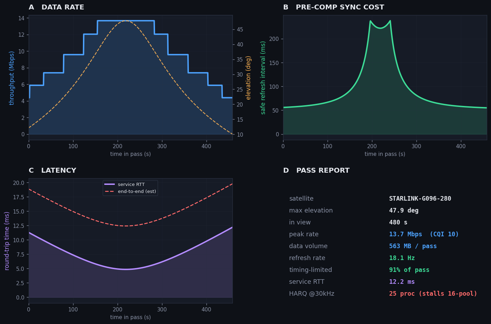

# Overpass 🛰️

**The flagship of a 12-week 5G Non-Terrestrial Networks portfolio.** Overpass is a live
web app that shows **what a 5G phone would see from a satellite passing overhead** — link
quality, data rate, how often it must re-synchronise, handover, and delay — from real
orbital data, in one click.

It wraps [`ntntoolkit`](https://github.com/shaifiqbal/ntn-toolkit) (the engine built in
Week 11) in a [Streamlit](https://streamlit.io) interface: pick a ground station, and it
fetches the live Starlink constellation, finds the best pass, and runs the whole
engineering chain end to end.

> **Live demo:** _add your Streamlit Community Cloud URL here after deploying (below)._



---

## What it shows

**Best pass** — for the highest satellite pass over your location:
- a plain-language summary anyone can read,
- headline metrics (max elevation, peak rate, data volume, round-trip time),
- a four-panel dashboard: data rate vs geometry, pre-compensation sync cost, latency,
  and a report card,
- the full engineering report on demand.

**Upcoming passes** — a ranked table of every pass over the next few hours, each with its
peak rate, data volume, refresh rate and RTT — a schedule, not just one pass.

The whole 12-week analysis (geometry, link budget, throughput, pre-compensation,
handover, latency/HARQ/TCP) runs behind a single **Analyze** button.

## Run it locally

```bash
python -m venv venv
venv\Scripts\activate            # Windows  (source venv/bin/activate on macOS/Linux)
pip install -r requirements.txt
streamlit run app.py             # opens in your browser
python -m pytest                 # 17 passing (engine + app)
```

## Deploy it free (public URL)

Streamlit Community Cloud hosts the app from this repo at no cost:

1. Push this repo to GitHub (public).
2. Go to **share.streamlit.io** and sign in with GitHub.
3. **New app** → pick this repo, branch `main`, main file `app.py` → **Deploy**.
4. In ~2 minutes you get a public `https://<name>.streamlit.app` URL. Paste it into the
   "Live demo" line above.

**Data note:** the app fetches live TLEs from Celestrak server-side (a browser User-Agent
is set, since Celestrak returns 403 without one) and **caches them for an hour**, so it
rarely hits the source. If a live fetch ever fails — Celestrak down, or a cloud IP being
rate-limited — the app **falls back to a bundled sample constellation** and shows a
"cached data" badge rather than breaking. Users never talk to Celestrak directly, so they
never see a 403.

## How it's built

```
app.py                 Streamlit UI (Overpass)
ntntoolkit/            the engine (consolidated 12-week portfolio)
  pass_geometry.py     visibility & orbits (SGP4/Skyfield)
  link_budget.py       geometry → SNR
  mcs_tables.py        3GPP CQI table
  throughput.py        SNR → throughput + data concentration
  precomp.py           pre-comp safe refresh interval
  handover.py          handover context
  delay.py / harq.py / tcp_model.py   latency, HARQ, TCP
  report.py            build_pass_report() → one PassReport
  window.py            all passes in a window, ranked (the flagship extension)
  flagship.py          analyze_best_pass() + dashboard_figure() for the app
  summary.py           plain-language summary
tests/                 17 tests (engine + app helpers)
```

## Honest notes

- RF/link-budget parameters are **indicative published-style values, not operator data** —
  they set the shape of the result, not an exact rate for any real network.
- Every engine module carries its original caveats (the 4.69 µs cyclic-prefix figure is a
  working timing yardstick, the end-to-end RTT is an estimate, throughput is single-layer,
  the delay is propagation-only). The app surfaces the results; it doesn't launder the
  assumptions.
- The offline fallback constellation is synthetic-but-physically-valid Starlink-class
  geometry; a live run uses the real current constellation.

## The 12-week portfolio

Overpass is the capstone. The full series, from link physics to this app:
[link budget](https://github.com/shaifiqbal/ntn-link-budget) ·
[pass predictor](https://github.com/shaifiqbal/ntn-pass-predictor) ·
[multi-sat scheduler](https://github.com/shaifiqbal/ntn-multi-sat-scheduler) ·
[visibility ML](https://github.com/shaifiqbal/ntn-sat-predictor-ml) ·
[timing & Doppler](https://github.com/shaifiqbal/ntn-5g-timing-doppler) ·
[pre-compensation](https://github.com/shaifiqbal/ntn-5g-ntn-precomp) ·
[adaptive refresh](https://github.com/shaifiqbal/ntn-adaptive-precomp) ·
[precomp-aware handover](https://github.com/shaifiqbal/ntn-precomp-aware-handover) ·
[link adaptation](https://github.com/shaifiqbal/ntn-link-adaptation) ·
[latency budget](https://github.com/shaifiqbal/ntn-latency-budget) ·
[toolkit](https://github.com/shaifiqbal/ntn-toolkit) · **Overpass (this repo)**

## License

MIT — see [LICENSE](LICENSE).
